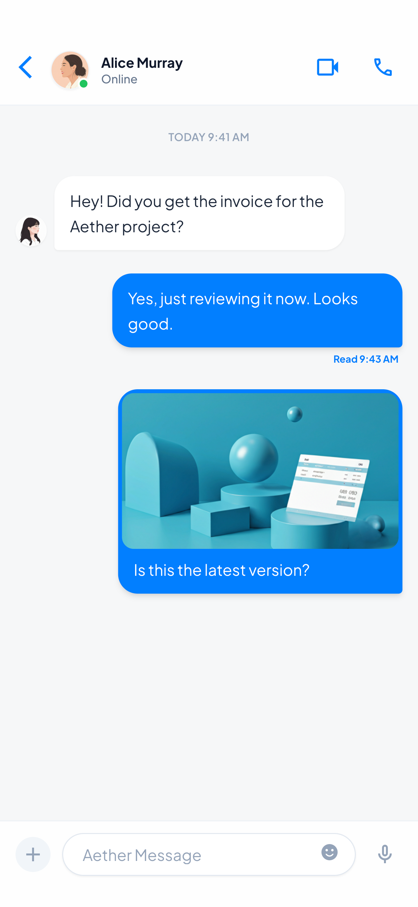

# GlobalConnect Messenger 🌍

A Microservices-based communication platform designed to replace traditional carrier plans.

## 🏗 Architecture


## 🚀 Tech Stack
- **Frontend:** React Native (Expo)
- **Backend:** Node.js, Express, TypeScript
- **Gateway:** API Gateway (Port 8080)
- **Databases:** PostgreSQL (User/Billing) & MongoDB (Chat History)
- **Infrastructure:** Docker & Docker Compose

## 📂 Services
1. **User Service:** Identity management (SQL).
2. **Chat Service:** Real-time messaging (NoSQL).
3. **Billing Service:** Payment history and subscription management.
4. **Notification Service:** Recurring Cron jobs for daily digests.
5. **API Gateway:** Central routing and logging.

## 🎨 UI Showcase
> Blueprints generated via Stitch AI.

<div align="center">
  <table border="0">
    <tr>
      <td><b>Chat Interface</b></td>
      <td><b>Dialer (VoIP)</b></td>
    </tr>
    <tr>
      <td></td>
      <td></td>
    </tr>
  </table>
  <p><i>Full UI flows available in the <a href="./docs/blueprints/">Docs Folder</a>.</i></p>
</div>

## ⚡️ How to Run
1. **Start Infrastructure:**
   ```bash
   npm run start:all
   ```
2. **Start Client:**
   ```bash
   cd client
   npx expo start
   ```
